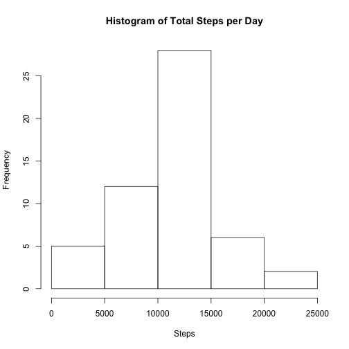
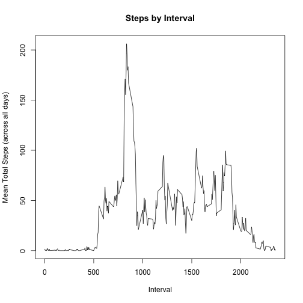
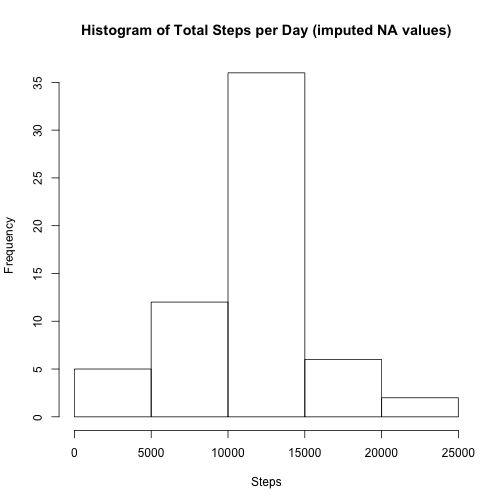
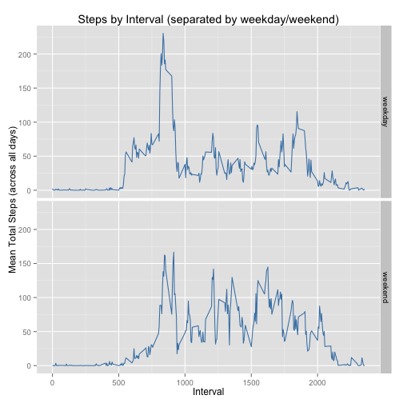

## Loading and preprocessing the data

```r
library(dplyr)
library(ggplot2)
```


```r
data <- read.csv(unz('activity.zip', 'activity.csv'))
data$date <- as.Date(as.character(data$date), '%Y-%m-%d')
aggData <- aggregate(steps ~ date, data = data, FUN = sum)
```


## What is mean total number of steps taken per day?

```r
hist(aggData$steps, main = 'Histogram of Total Steps per Day', xlab = 'Steps')
```

 

```r
aggData %>% summarize(mean = mean(steps, na.rm = TRUE), median = median(steps, na.rm = TRUE))
```

```
##       mean median
## 1 10766.19  10765
```

## What is the average daily activity pattern?

```r
aggData <- aggregate(steps ~ interval, data = data, FUN = mean)
plot(aggData$interval, aggData$steps, type='l', xlab = 'Interval',
     ylab = 'Mean Total Steps (across all days)', main = 'Steps by Interval')
```

 

```r
aggData[which.max(aggData$steps),]
```

```
##     interval    steps
## 104      835 206.1698
```
The 8:35 interval has the maximum number of steps averaged across all the days (206.17).

## Imputing missing values

```r
summary(data)
```

```
##      steps             date               interval     
##  Min.   :  0.00   Min.   :2012-10-01   Min.   :   0.0  
##  1st Qu.:  0.00   1st Qu.:2012-10-16   1st Qu.: 588.8  
##  Median :  0.00   Median :2012-10-31   Median :1177.5  
##  Mean   : 37.38   Mean   :2012-10-31   Mean   :1177.5  
##  3rd Qu.: 12.00   3rd Qu.:2012-11-15   3rd Qu.:1766.2  
##  Max.   :806.00   Max.   :2012-11-30   Max.   :2355.0  
##  NA's   :2304
```
2304 rows have NA values.

We will use the mean for the interval to replace the NA values.

```r
combined <- merge(data, aggData, by="interval")
combined[is.na(combined$steps.x), 'steps.x'] <- combined[is.na(combined$steps.x), 'steps.y']
imputed <- combined %>% select(date, interval, steps = steps.x)
aggImputed <- aggregate(steps ~ date, data = imputed, FUN = sum)
hist(aggImputed$steps, main = 'Histogram of Total Steps per Day (imputed NA values)', xlab = 'Steps')
```

 

```r
aggImputed %>% summarize(mean = mean(steps), median = median(steps))
```

```
##       mean   median
## 1 10766.19 10766.19
```
In the histogram, imputing the NAs made the bucket with max frequency have even higher frequency.
The mean and median were pretty much unchanged (and are equal to each other).

## Are there differences in activity patterns between weekdays and weekends?

```r
imputed <- imputed %>% mutate(day_type = ifelse(weekdays(date) %in% c('Saturday', 'Sunday'),
                       'weekend', 'weekday'))
imputed$day_type <- sapply(imputed$day_type, factor)
aggImputed <- aggregate(steps ~ interval + day_type, data = imputed, FUN = mean)
summary(aggImputed[aggImputed$day_type == 'weekday',])
```

```
##     interval         day_type       steps        
##  Min.   :   0.0   weekday:288   Min.   :  0.000  
##  1st Qu.: 588.8   weekend:  0   1st Qu.:  2.247  
##  Median :1177.5                 Median : 25.803  
##  Mean   :1177.5                 Mean   : 35.611  
##  3rd Qu.:1766.2                 3rd Qu.: 50.854  
##  Max.   :2355.0                 Max.   :230.378
```

```r
summary(aggImputed[aggImputed$day_type == 'weekend',])
```

```
##     interval         day_type       steps        
##  Min.   :   0.0   weekday:  0   Min.   :  0.000  
##  1st Qu.: 588.8   weekend:288   1st Qu.:  1.241  
##  Median :1177.5                 Median : 32.340  
##  Mean   :1177.5                 Mean   : 42.366  
##  3rd Qu.:1766.2                 3rd Qu.: 74.654  
##  Max.   :2355.0                 Max.   :166.639
```

```r
p <- ggplot(aggImputed, aes(interval, steps)) + geom_line(color = 'steelblue') + facet_grid(day_type ~ .) +
     labs(x = 'Interval', y = 'Mean Total Steps (across all days)',
          title = 'Steps by Interval (separated by weekday/weekend)')
print(p)
```

 

For most intervals, weekend has more steps (and a higher overall mean and median).  However, weekday has a
higher maximum value and is higher in the early morning and early evening intervals.
